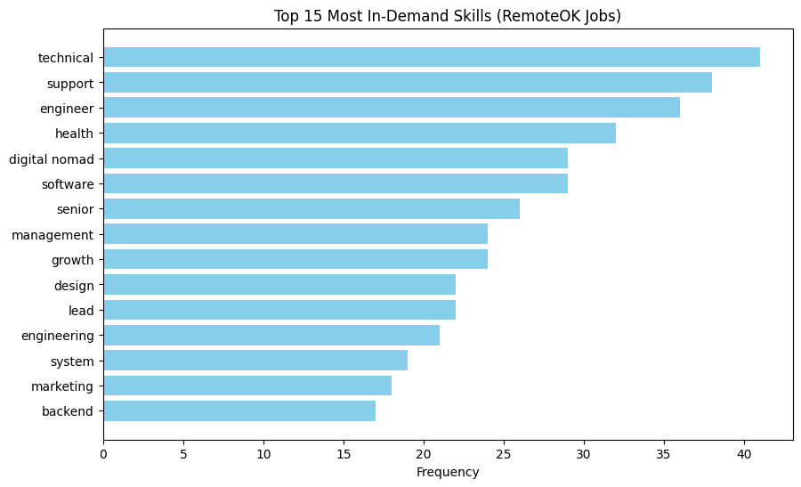

# 📊 RemoteOK Job Skill Analysis

This project fetches **remote job postings** from the [RemoteOK API](https://remoteok.com/api), cleans and analyzes job skill requirements, and visualizes the **top in-demand skills** using Python.

## 🚀 Features
- Scrapes job postings (98 jobs in this dataset) via the RemoteOK API
- Extracts and cleans skills from job descriptions
- Identifies **most frequently required skills**
- Visualizes results with bar charts

## 🛠️ Tools & Libraries
- **Python 3**
- `requests` – API fetching
- `pandas` – data cleaning and analysis
- `matplotlib` – visualization
- `collections.Counter` – frequency counting

## 📈 Sample Output
Top 15 Most In-Demand Skills (from scraped jobs):

| Rank | Skill         | Count |
|------|---------------|-------|
| 0    | technical     | 41    |
| 1    | support       | 38    |
| 2    | engineer      | 36    |
| 3    | health        | 32    |
| 4    | digital nomad | 29    |
| 5    | software      | 29    |
| 6    | senior        | 26    |
| 7    | management    | 24    |
| 8    | growth        | 24    |
| 9    | design        | 22    |
| 10   | lead          | 22    |
| 11   | engineering   | 21    |
| 12   | system        | 19    |
| 13   | marketing     | 18    |
| 14   | backend       | 17    |

And a bar chart visualization 📊 is generated via `matplotlib`.

## 📜 License
This project is licensed under the Apache 2.0 License.
